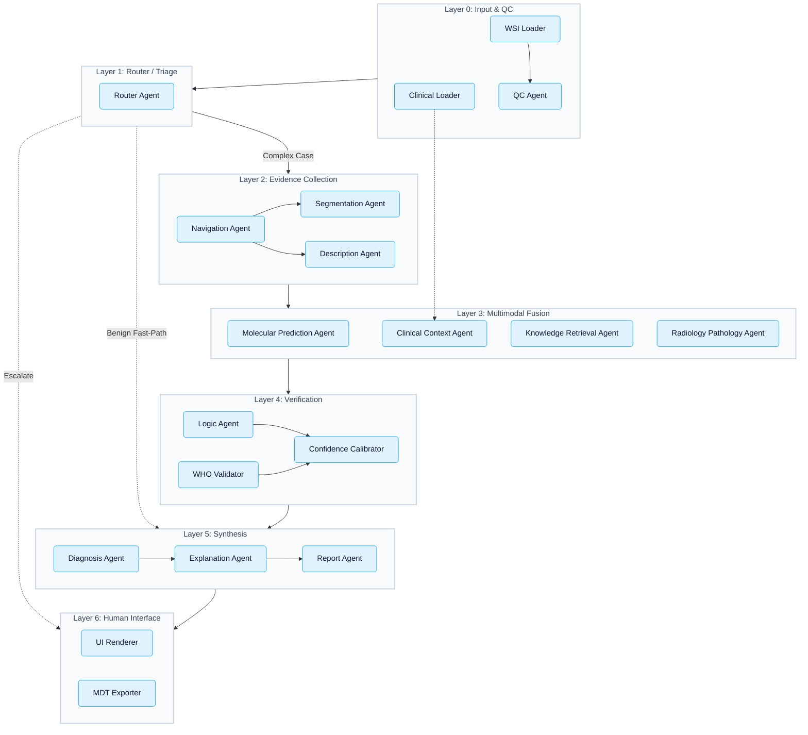
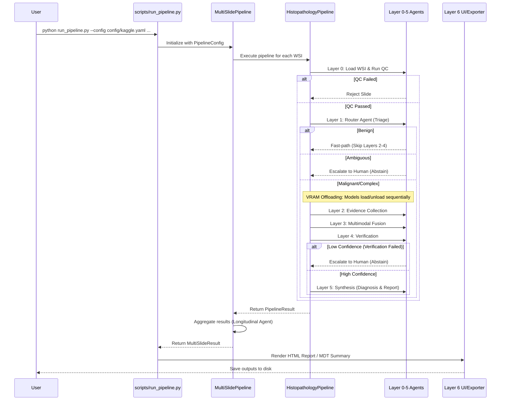

# hakim_ai

**End-to-end explainable multi-agent histopathology AI for gastric cancer / STAD**

> [!WARNING]
> Research prototype — not approved for clinical diagnostic use without pathologist oversight.

---

## Overview

`hakim_ai` is a production-ready, comprehensive multimodal AI pipeline designed to tackle gastric cancer (stomach adenocarcinoma, STAD). It acts as an expert diagnostic assistant capable of integrating whole-slide images (WSI), clinical electronic health records (EHR), radiology imaging (DICOM), and molecular history.

### Why Gastric Cancer?

- **3rd in global cancer mortality** (GLOBOCAN 2022) with the highest burden in the Asia-Pacific.
- **AI saturation** — Explainable AI for gastric cancer lags significantly behind breast and lung cancer.
- **Multiple tractable H&E tasks**: Subtyping (Lauren classification), MSI/dMMR prediction, and EBV detection.
- **Clear clinical value**: E.g., MSI-H status predicts pembrolizumab eligibility.

### Architecture

The system utilizes a robust 7-layer architecture. Each layer delegates specific responsibilities to domain-focused AI agents, ensuring explainability, verification, and clinical safety.



**Key Design Principles**:
- **Separation of LLM Planning & Image Execution**: Based on the TissueLab pattern.
- **Natural Language Explanations**: Overlays traditional heatmaps to reduce cognitive load (PathFinder pattern).
- **Explicit Verification**: Ensures independent validation via WHO taxonomy and clinical logic prior to reporting (WSI-Agents pattern).
- **Graceful Degradation**: System handles missing modalities (like radiology) seamlessly.
- **Actionable Abstention**: The pipeline employs temperature scaling and energy-based OOD detection to escalate ambiguous or low-confidence slides directly to human pathologists.

### Execution Flow

The orchestrator dynamically routes slides based on triage results, effectively bypassing intensive compute layers for obvious benign cases while ensuring rigorous evidence collection for malignancies. VRAM is stringently managed through sequential agent execution, ensuring stability on constrained environments like Kaggle T4 GPUs.



---

## Quick Start

### Install System Dependencies

For robust WSI parsing and archive handling (especially on Kaggle):
```bash
apt-get update && apt-get install -y openslide-tools unrar
```

### Install Python Environment

Clone and install with the full suite of foundation models and data management tools:
```bash
git clone https://github.com/sudouserx/hakim_ai
cd hakim_ai
pip install -e ".[dev,data,models]"
```

Provide a `.env` file in the root directory if utilizing Hugging Face models (like UNI2 or LLAVA):
```env
HF_TOKEN=hf_your_huggingface_token
```

### Dataset Preparation

The pipeline includes an automated, resilient data manager to acquire and preprocess datasets from official sources. It includes robust retry logic and exponential backoff to handle transient API failures (e.g., from cBioPortal).

```bash
# Download and prepare all datasets (TCGA-STAD, GasHisSDB, GCHTID)
python scripts/prepare_data.py --all

# Download a specific dataset (Use --max-slides for fast testing or limited storage)
python scripts/prepare_data.py --dataset tcga-stad --max-slides 50

# Dry-run to preview operations without downloading
python scripts/prepare_data.py --all --dry-run
```

### Configuration

Configuration is centralized via `hakim_ai/config.py` leveraging environment-specific YAML files located in `config/`. 
Environment configs dynamically merge over the default settings, ensuring type-safe access to variables across the system without redundant declarations.

Available environments:
- `config/default.yaml`: Base settings.
- `config/kaggle.yaml`: Tailored for T4 single-GPU constraints (disables parallel multislide to prevent VRAM exhaustion).
- `config/prod.yaml`: Multi-GPU setup for high-throughput parallel processing.
- `config/test.yaml`: Minimal resource configuration for CI/CD.

### Model Training

The pipeline includes native, memory-efficient training loops utilizing **Focal Loss** to penalize majority classes and gradient accumulation for managing gigapixel MIL bags without tensor padding issues.

Execute training scripts via:

```bash
# Train the Multiple Instance Learning (MIL) model for Molecular / Subtype classification
python hakim_ai/training/train_mil_classifier.py --config config/kaggle.yaml

# Train the Routing / Triage Classifier
python hakim_ai/training/train_router.py --config config/kaggle.yaml

# Train the Semantic Segmentation Model
python hakim_ai/training/train_segmentation.py --config config/kaggle.yaml
```

After training, threshold optimization can be calibrated automatically:
```bash
python scripts/calibrate_thresholds.py --config config/kaggle.yaml
```

### Running the Full Pipeline

Use the unified CLI entry point `scripts/run_pipeline.py` to evaluate slides. This invokes the `MultiSlidePipeline` orchestrator capable of analyzing single or multiple sequential biopsies.

```bash
python scripts/run_pipeline.py \
    --config config/kaggle.yaml \
    --patient-id TCGA-BR-4253 \
    --wsi-path /data/slides/TCGA-BR-4253.svs \
    --radiology /data/dicom/CT_study.dcm \
    --age 67 --sex M \
    --biopsy-location antrum \
    --h-pylori \
    --endoscopy "3.2cm ulcerative lesion, antrum" \
    --save-report --save-mdt
```

### Running Tests

The test suite validates agents, logic, and orchestrators completely isolated from real model weights, ensuring rapid iterative feedback.

```bash
pytest                          # Run all tests
pytest --cov=hakim_ai           # Run with coverage
```

---

## Datasets and Annotations

The dataset infrastructure automatically structures raw data into standard formats suitable for training the `hakim_ai` agents.

| Dataset | Content | Access | Processing |
|---|---|---|---|
| **TCGA-STAD** | ~400 WSIs + Clinical EHR | Public (GDC) | Fetches WSI via GDC. Merges `stad_tcga` demography with `stad_tcga_pub` molecular targets (MSI, EBV, Lauren). |
| **GasHisSDB** | 245K uniform patches | Public (Zenodo) | Processes raw RAR archives, strict 160×160 resolution filtering, deterministic split generation. |
| **GCHTID** | 31K images, TME labels | Public (figshare) | Maps raw 9-class annotations into a 7-class standardized taxonomy for segmentation. |
| **NCT-CRC-HE** | 100K patches | Public (Zenodo) | Used strictly as pretraining proxy data for generalized tissue segmentation. |

> [!CAUTION]
> The GCHTID labels are weak proxy boundaries. The segmentation outputs function as tile-level tissue-composition estimators, not pixel-perfect delineators.

---

## Core Capabilities Highlights

- **Dynamic Navigation & Morphological Phenotyping**: The `NavigationAgent` clusters patch feature embeddings (via K-Means) and extracts high-confidence phenotypes, guaranteeing the downstream VLM evaluates an exhaustively representative set of tumor morphologies.
- **Attention-Based Clinical Fusion**: By computing dot-product cosine similarity between Vision-Language textual embeddings and clinical EHR text, the system seamlessly fuses unstructured data into the visual feature space.
- **Verification Calibrator**: Calculates LogSumExp distributions over model logits to catch "Out of Distribution" (OOD) inferences. Instead of providing confident wrong answers on unexpected tissue artifacts, the pipeline immediately halts and flags for a human pathologist.

---

## Citation & Attribution

If you utilize this codebase for academic research, please cite:

```bibtex
@software{histopath_ai_2025,
  title  = {hakim\_ai: End-to-end explainable multi-agent histopathology AI for gastric cancer},
  year   = {2025},
  note   = {Architecture based on PathFinder (ICCV 2025), WSI-Agents (MICCAI 2025),
            and TissueLab (arXiv 2509.20279)},
}
```

**Foundation Models**: This system dynamically loads models requiring explicit attribution in downstream works:
- **CONCH**: Lu et al., *Nature Medicine* 2024.
- **UNI2**: Chen et al., *Nature Medicine* 2024.

---

## License

MIT License — see `LICENSE` for details.

> **Disclaimer**: This software is provided for research purposes only. It is not a medical device and has not received regulatory clearance (FDA, CE-IVD, or equivalent). All AI-generated diagnostic outputs require review and sign-off by a qualified pathologist before any clinical action.